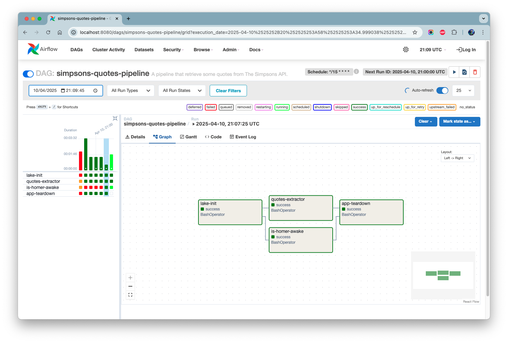

# Hello Airflow 👋


This project is an experiment using [Apache Airflow](https://airflow.apache.org/).  
I've desined a simple DAG using the basic operator to explore what Airflow can do.  
Of course, in real life situations you'd use other operators to probably manage external services.

## Quick Start

Let's start the Airflow 🚀

```bash
docker-compose up -d
```

> Airflow will be running at `http://localhost:8080/admin/`.  
> To stop, just type `docker-compose down`



## Appendix

### Dev Setup

In case you want to check and/or update the scripts.

```bash
# 👇 Setting PyEnv version
pyenv local 3.8.20

# 👇 Virtual Environment
python -m venv .venv \
  && source .venv/bin/activate \
  && pip install --upgrade pip

# 👇 Dependencies
pip install -r requirements-dev.txt
```

### Using Local Operator

In this example I'm using the `SequencialOperator` and `SQLite`, to make things simpler.  
However, if you want, you can use the `LocalOperator` and `PostgreSQL` to have tasks running in parallel, for example.

> 💡 [Reference](https://airflow.apache.org/docs/apache-airflow/2.10.5/core-concepts/executor/index.html#executor-types)

Here's an example on how to configure that in this project...

```yml
# docker-compose.yml
services:
    db:
        container_name: postgres
        image: postgres
        environment:
            POSTGRES_USER: admin
            POSTGRES_PASSWORD: pass4admin
            POSTGRES_DB: airflow
    airflow:
        # Add the follwing fields to the existing configuration
        depends_on:
            - db
        environment:
            AIRFLOW__CORE__SQL_ALCHEMY_CONN: "postgresql+psycopg2://admin:pass4admin@db:5432/airflow"
            AIRFLOW__CORE__EXECUTOR: "LocalExecutor"
```

### Related Links

- [Airflow: Trigger Rules](https://airflow.apache.org/docs/stable/concepts.html#trigger-rules)
- [Medium: First Steps Using Airflow](https://medium.com/data-hackers/primeiros-passos-com-o-apache-airflow-etl-f%C3%A1cil-robusto-e-de-baixo-custo-f80db989edae)
- [Medium: Airflow Basic Configuration](https://medium.com/@apratamamia/airflow-basic-configuration-for-production-environment-2f69ab0c6f2c)
- [Blog: How to use Docker Operator?](https://marclamberti.com/blog/how-to-use-dockeroperator-apache-airflow/)
- [The Simpsons API](https://www.postman.com/simpsons-team)
- Airflow Operators
  - [Astronomer - What is an Operator?](https://www.astronomer.io/docs/learn/what-is-an-operator)
  - [Some Operators](https://airflow.apache.org/docs/apache-airflow/stable/howto/operator/index.html)
